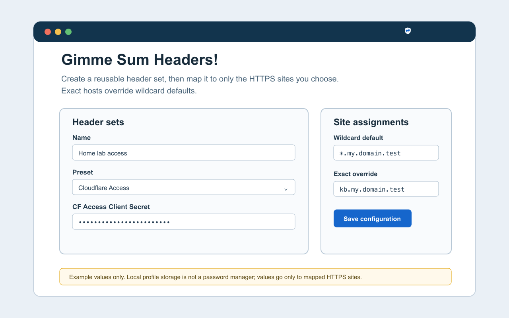
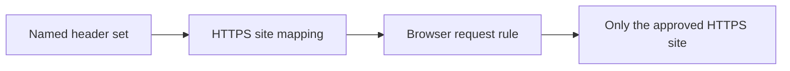

<p align="center">
  
</p>

<h1 align="center">Gimme Sum Headers!</h1>

<p align="center">
  <strong>Reusable request headers—only on the HTTPS sites you choose.</strong>
</p>

<p align="center">
  <a href="https://github.com/jeeftor/gimme-sum-headers/releases"></a>
  <a href="LICENSE"></a>
  
</p>

<p align="center">
  <a href="#get-started">Get started</a>
  ·
  <a href="#how-it-works">How it works</a>
  ·
  <a href="#security--privacy">Security</a>
  ·
  <a href="docs/store-signing.md">Release &amp; signing</a>
</p>

<p align="center">
  
</p>

---

**Gimme Sum Headers!** is a Manifest V3 extension for Chrome and Firefox. Create a reusable header set once, map it to the HTTPS sites that need it, and let the browser apply it only where you approved it.

<p align="center">
  
</p>

## Why it exists

Your home lab and internal tools often need the same authentication header in more than one place. This extension keeps that configuration tidy:

| Create once | Map precisely | Override safely |
| --- | --- | --- |
| Define a named header set. | Attach it to one exact host or wildcard default. | An exact hostname replaces the matching wildcard; sets never merge. |



## How it works

1. **Create a header set** using one of the built-in presets or safe custom headers.
2. **Map it to sites** in Settings—or open the toolbar popup on an HTTPS page and apply an existing set to that exact host.
3. **Save once.** The browser asks only for the corresponding host permission and installs its request rule locally.

For example:

```text
*.my.domain.test       → Default headers
kb.my.domain.test      → Knowledge-base token     # exact override
dvr.my.domain.test     → Media services token
paste.my.domain.test   → Media services token
jellyfin.my.domain.test → Media services token
```

`kb.my.domain.test` wins over `*.my.domain.test`. It does not combine both sets.

## Header sets

| Preset | What it adds | Best for |
| --- | --- | --- |
| **Cloudflare Access** | `CF-Access-Client-Id` + `CF-Access-Client-Secret` | Cloudflare Access Service Auth policies |
| **Bearer token** | `Authorization: Bearer <token>` | APIs and self-hosted apps |
| **Custom headers** | One or more header name/value pairs | Service-specific integration headers |

Custom sets deliberately reject browser- and connection-controlled headers such as `Cookie`, `Host`, `Origin`, `Referer`, `User-Agent`, `Proxy-*`, and `Sec-*`.

> [!TIP]
> Cloudflare Access service tokens must be allowed by a **Service Auth** policy on the protected Access application. With only Service Auth policies, the two Access headers are required on every request.

## Security & privacy

> [!WARNING]
> Header values are stored in your local browser profile and in its local request-rule state so they can work after a browser restart. This is **not** a password manager, encrypted secret vault, or hardware-backed credential store. Do not use credentials whose exposure would be unacceptable.

- Header values and site mappings stay in `storage.local`—never browser sync.
- Host permission is requested only for the enabled HTTPS scopes you configure.
- No accounts, telemetry, analytics, remote configuration, request logging, or developer-operated server.
- Use dedicated, least-privilege credentials. Prefer exact hosts; a wildcard sends its header set to every matching subdomain.
- Enable full-disk encryption and revoke credentials if the browser profile or device is compromised. **Forget all configuration** removes local values, rules, and granted host permissions; it cannot revoke a credential at its issuer.

The extension injects headers only into HTTPS requests that reach the browser network stack. It cannot alter a response served entirely from a page's Service Worker or CacheStorage.

Read the full [privacy policy](PRIVACY.md).

## Get started

### Install a release

Each [GitHub Release](https://github.com/jeeftor/gimme-sum-headers/releases) provides browser-specific ZIPs. For a local Chrome, Chromium, or Microsoft Edge install:

1. Download and unzip `gimme-sum-headers-chrome.zip`.
2. Open `chrome://extensions` or `edge://extensions`.
3. Enable **Developer mode**, choose **Load unpacked**, then select the unzipped directory.

Firefox installs and updates through the public AMO listing after Mozilla approves the submitted version.

### Run from source

<details>
<summary><strong>Chrome, Chromium, or Microsoft Edge</strong></summary>

1. Open `chrome://extensions` or `edge://extensions`.
2. Enable **Developer mode**.
3. Choose **Load unpacked** and select this repository directory.

</details>

<details>
<summary><strong>Firefox</strong></summary>

1. Open `about:debugging#/runtime/this-firefox`.
2. Choose **Load Temporary Add-on**.
3. Select `manifest.json` from this repository.

</details>

## Build, verify, release

```sh
make check
make package
make firefox-package
```

`make` alone prints the available targets. Tagged releases build both browser-specific ZIPs and generate GitHub artifact provenance attestations:

```sh
gh attestation verify gimme-sum-headers-chrome.zip --repo jeeftor/gimme-sum-headers
gh attestation verify gimme-sum-headers-firefox.zip --repo jeeftor/gimme-sum-headers
```

GitHub provenance proves where a ZIP came from; it does not replace browser-store signing. Chrome Web Store and Mozilla/AMO are responsible for browser-trusted installation and updates. See the [browser-store signing guide](docs/store-signing.md) for the one-time setup and protected GitHub environment configuration.

---

<p align="center">
  Built for the moments when you just need to <strong>gimme sum headers</strong>.
</p>
